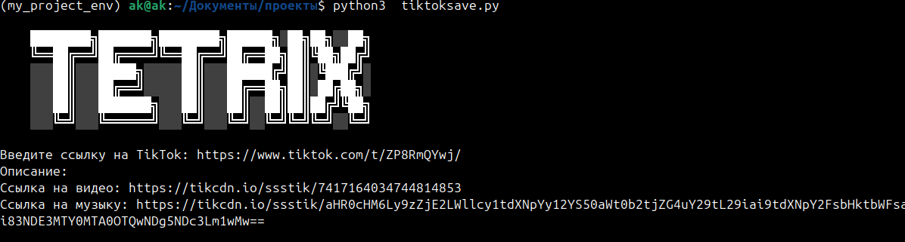

Вот обновленный файл `README.md`, включающий вашу разметку и форматирование:

```markdown
# Загрузчик видео TikTok

Простой скрипт на Python для загрузки видео и музыки из TikTok с использованием сервиса SSSTik.

## Возможности

- Загрузка видео TikTok без водяных знаков.
- Получение ссылок на музыку, связанную с видео TikTok.
- Отображение описаний видео, ссылок на загрузку и ссылок на музыку в удобном формате.

## Требования

Перед запуском скрипта убедитесь, что у вас установлены следующие библиотеки:

- `requests`: Для работы с HTTP-запросами.
- `beautifulsoup4`: Для парсинга HTML-контента.

Вы можете установить необходимые библиотеки с помощью следующей команды:

```bash
pip install -r requirements.txt
```

## Использование

1. Клонируйте репозиторий:

    ```bash
    git clone https://github.com/TETRIX8/tiktok-save.git
    ```

2. Перейдите в директорию проекта:

    ```bash
    cd tiktok-save
    ```

3. Запустите скрипт:

    ```bash
    python3 tiktoksave.py
    ```

4. Когда будет предложено, введите URL видео TikTok, которое вы хотите загрузить.

Скрипт отобразит:
- Описание видео
- Прямую ссылку на загрузку видео
- Прямую ссылку на музыку

## Пример

```plaintext
Введите ссылку на TikTok: https://www.tiktok.com/@example/video/1234567890
Описание: Удивительное видео TikTok!
Ссылка на видео: https://tikcdn.io/ssstik/7417164034744814853
Ссылка на музыку: https://tikcdn.io/ssstik/music_link_here
```
# Загрузчик видео TikTok

Простой скрипт на Python для загрузки видео и музыки из TikTok с использованием сервиса SSSTik.


